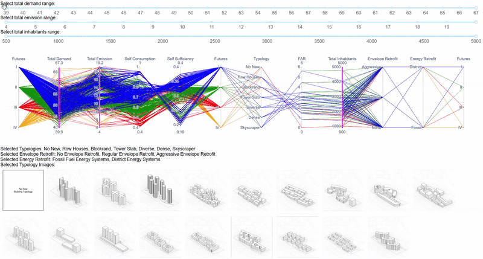

# plausible_future_UBEM
 Repository for design explorer of Plausible Future UBEM in CISBAT 2025

# Requirements
This repository is tested for python 3.12  
The required libraries are listed in requirements.txt, which can be installed using:
``` pip install -r ./requirements.txt ```

# Running the explorer
Simply run: ``` python ./design_explorer_demo.py ```

and follow the HTML link to explore the designs.
Sample of the exploration:


# Citing
TODO